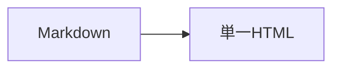

# mdh — 最終設計・Codex実装計画

- 設計レビュー日: 2026-10-01
- 状態: 実装前の推奨仕様。実機検証・完成認定ではない。
- リポジトリ: `ryoheiii/markdown-to-html`（2026-10-02、利用者指定の正式名）
- CLI名: `mdh`
- npmパッケージ名候補: `@ryoheiii/mdh`（npmへの公開は初期版の必須条件にしない）
- この文書は、会話中の数式対応・Mermaid事前SVG化などの旧案を置き換える。

## 1. 目的と設計原則

一般的なMarkdown、Mermaid、ローカル画像から、PCで読みやすく、単独で持ち運べるHTMLを生成する。

通常の操作は `mdh document.md`。初回導入の違いを除き、Windows・Ubuntu・WSLで同じCLI仕様を使う。VS CodeはこのCLIを呼び出し、別の変換経路を持たない。

優先順位は、正しく読めること、単一HTML・オフライン、日常操作の簡単さ、保守する独自コードの少なさ、の順。依存パッケージ数を形式的にゼロにするために複雑な自作コードを増やさない。

「世界基準」は認証名ではない。公式の機能を利用すること、対応範囲が明確であること、アクセシビリティの基礎、再現可能な導入、失敗を隠さないこと、実機・配布物のテストで評価する。

## 2. 採用・不採用

### 採用

| 要素 | 役割 |
|---|---|
| Node.js製の小さなCLI | 引数、パス、Pandoc起動、資産確認、出力確定 |
| Pandoc | Markdown解析、見出しID、目次、コードハイライト、HTML生成、画像埋め込み |
| Mermaid公式の完成済み単一JS版 | HTMLを開いたブラウザーで図を描画 |
| 専用HTMLテンプレート・CSS・小さなJS | ダークブルーのレイアウト、コードコピー、目次開閉 |
| npmのbin機構 | `mdh`のPATH登録 |
| VS Codeの標準タスク | 保存済みの現在ファイルをCLIで変換 |

### 不採用

Python/uvの追加、Mermaid CLI、通常変換でのPuppeteer/Playwright/Chrome起動、数式専用処理、CDN、外部画像取得、常駐サーバー、React/Vue、独自Markdownパーサー、自前のMermaidバンドラー、複数テーマ、プラグイン基盤、階層的設定システム、監視・自動更新、PDF出力、複数文書結合、独自VS Code拡張、画像最適化、図の編集・パン・ズームは初期版に入れない。

Playwright等を開発・CIのテスト専用に使うことは認める。利用者の通常インストール・変換時のブラウザー依存とは分離する。

## 3. 技術構成

### 3.1 CLIとPandoc

CLIはJavaScriptのES modulesを基本とし、Node.js標準APIを優先する。TypeScriptのビルド基盤は初期版では追加しない。必要箇所はJSDoc等で意図を明示する。

Pandocを外すことで、見出しID、目次、構文ハイライト、画像埋め込みを別実装・別ライブラリに分散させない。今回はPandocを残す。

文書処理はPandocのJSON ASTをNode.js側で扱う一本の経路にする。Markdown本文や完成HTML全体を正規表現で解析し直さない。Luaフィルター等との二重実装はしない。

```text
Markdown
  → PandocでJSON ASTへ解析
  → 参照画像・入力範囲を確認し、Mermaidブロックを安全にマーク
  → Pandocで目次・ハイライト・HTML・資産埋め込みを生成
  → 完成した一時HTMLを出力先へ置き換える

HTMLを開く
  → 本文・画像・目次を表示
  → コピーと目次開閉を有効化
  → Mermaidをブロックごとに描画
```

数式用の拡張は有効にしない。具体的なPandocオプションは採用版の`--list-extensions`等で確認し、数式風テキストが勝手に処理されないfixtureを用意する。

### 3.2 Mermaidの配布

公式の`mermaid.min.js`単一ファイル版をバージョン固定で同梱する。ESMの入口ファイルだけをコピーしない。公式単一ファイル版を利用するため、esbuild/Vite/Webpack等を本プロジェクトの必須構成に加えない。

完成済みの公式JSはvendor資産として扱い、由来・バージョン・必要なライセンス表記を記録する。利用者の変換時にダウンロードしない。不要な外部source map参照を残さない。ライセンス表示は削除しない。

Mermaidを含むHTMLにだけ、このJSを一度だけ埋め込む。複数図があっても複製しない。Mermaidを含まない文書には埋め込まない。

公式フル版を基本とする。Tiny版による図種・機能の縮小や独自forkでの削減は初期版で行わない。数式機能を実装しないことと、上流Mermaidの内部に数式関連コードが一切存在しないことは別である。後者を目的に上流コードを改造しない。

HTMLサイズはMermaidライブラリと画像の分だけ増える。容量ゼロ増加や極小HTMLは要求しない。採用版の実サイズをREADMEのサンプルで示し、固定の根拠のない容量・速度保証をしない。

### 3.3 バージョン方針

レビュー時点ではNode.js 24系LTSを基準候補とする。実装時の検証済みパッチ版を開発・CIで合わせ、対応範囲をpackage.jsonとREADMEに明記する。

Pandocは採用する機能を満たす版を必須とする。初期候補は3.8以上だが、最低版は実際にその版でテストしてから確定する。古いUbuntu同梱版への複雑な互換分岐は作らない。

Mermaidは同梱版を固定する。更新時はオフライン・図の表示・日本語・ライセンスのテストを実行する。図のテーマ、フォント、look、layoutは検証した値を明示し、上流の既定値変更に不用意に依存しない。

## 4. 対応入力

### 4.1 Markdown

GFM系の一般的な構文を対象にする。見出し、段落、強調、箇条書き・番号付きリスト、入れ子、引用、表、打ち消し、チェックリスト、リンク、参照形式画像、コードフェンスを確認する。

GitHubの表示との完全一致や、すべての独自拡張への対応は保証しない。Pandoc独自の出版機能や設定用front matterは初期版の中心機能にしない。

入力と出力はUTF-8。UTF-8 BOMおよびLF/CRLFの入力を扱う。文字コードの自動推定はしない。不正なUTF-8は明確に失敗させる。

数式の解析・描画はしない。`$...$`等は通常のテキストとして扱い、`math`コードフェンスは通常のコード表示とする。

任意の生HTMLやスクリプトを実行する機能は提供しない。非対応の生HTMLは勝手に消さず、文字として表示する方針を基本とし、採用Pandoc設定で動作を確認する。コードブロック内のHTML例は当然表示・コピーできる。HTMLサニタイザーや任意HTMLの完全変換サービスは作らない。

### 4.2 ローカル画像

PNG、JPEG、WebP、GIF、外部資産に依存しないSVGを対象とする。元画像を変色・圧縮・自動反転しない。

```markdown


```

相対画像パスは常に入力Markdownのディレクトリを基準に解決する。絶対パスは実行環境のネイティブパスを使用する。Markdown内の相対パスは`/`表記を推奨する。

画像が見つからない場合や、表示用のHTTP(S)・プロトコル相対URL等がある場合は変換失敗にする。入力が「画像」に見えるかはASTのImage等で判断し、通常のリンクURLを誤って禁止しない。

ローカルSVGは`img`の画像文脈で埋め込み、本文DOMへ任意のSVGコードを直接注入しない。SVG内の外部画像・外部フォント・スクリプトを利用した図はサポートしない。SVGの依存資産を再帰的に収集したり、自動修復したりしない。既知の外部参照はエラーとして説明するが、任意SVGの完全な検証・安全化をうたわない。

Mermaid図の中に画像や外部アイコンを取り込む機能も初期版では扱わない。ローカル画像は通常のMarkdown画像として置く。

## 5. self-containedの定義

生成したHTMLだけを別PC・別フォルダーへ移し、元Markdown・画像フォルダー・キャッシュ・ネットワークがなくても、対応範囲の本文・画像・目次・装飾・コード・Mermaidを利用できること。

HTMLを開いてからMermaidを描画してよい。self-containedは描画済みであることを意味しない。

CSS、本ツールのJS、必要なMermaid JS、ローカル画像をHTML内に含める。CDN、外部Webフォント、外部JS、追加モジュール読み込み、表示用fetch、外部スタイルシートに依存しない。本文とMermaidはOSの日本語対応フォントを利用し、フォントファイルを配布しない。OS間のピクセル単位の同一表示は求めない。

通常のWebリンク、他ファイルへのリンク、同じ文書の見出しリンクは区別する。Webリンクや他文書はリンク先まで同梱しない。他のMarkdownへのリンクを自動結合・自動変換しない。リンクをクリックした後の通信は、表示用通信ゼロの検査から除く。

Pandocは`--standalone --embed-resources`を使う。非推奨の`--self-contained`を新規コードの主設定にしない。ただし`--embed-resources`自体には外部資産を取得する機能があるので、禁止参照はPandocに資産処理させる前に確認する。

固定のCSP等で表示用の外部通信・外部スクリプト・外部フォントを抑止する。インラインの本ツールJS、Mermaid描画、埋め込み画像は許可し、実際のオフラインテストで検証する。独自認証、複雑なnonce管理、権限管理サービス等は作らない。これは不特定他者の入力を処理するWebサービスではなく、利用者が管理するMarkdown用のローカルツールである。

## 6. Mermaidの動作

````markdown

````

上の例は、言語名が`mermaid`の通常のコードフェンスを意味する。引用・リスト内のフェンスもASTから処理する。外側の長いフェンスに入れた説明用コードを誤認しない。

図は閲覧時にブラウザーでSVGへ描画する。`startOnLoad: false`で管理し、ブロックごとに失敗を捕捉する。ソースはHTMLテキストとして正しくエスケープし、JSの実行文字列へ直接連結しない。

青系の専用テーマ、OSフォント、`securityLevel: strict`を基本とする。外部アイコンパックや追加プラグインは使わない。図の見た目を変えるユーザー独自のJS/CSS読み込み機能は作らない。

大きな図は、文字が読めなくなるまで無条件に縮小せず、必要なら横スクロールする。小さな図は不要に拡大しない。元ソースの常時表示、専用のソース開閉UI、ズーム・パン・画像書き出しボタンは不要。

### エラーの契約

この方式では、CLIの正常終了はHTML生成の成功を意味し、Mermaid描画の成功を意味しない。通常変換で図の描画成功を事前保証しない。

構文や描画のエラーはHTML上の該当図の場所に表示し、元ソースを残す。エラーをコンソールだけに隠さず、他の図、本文、コードコピー、目次は使える状態を維持する。

JavaScript無効時は、本文と画像と目次リンクを残し、Mermaidはソースと説明を表示する。コードコピーと折り畳みはJSが必要なことを明記する。

## 7. デザイン

ダークブルーの単一テーマを採用する。万人に唯一最適なテーマとは主張しない。

| 項目 | 設計初期値 |
|---|---|
| 背景 | `#0F172A` |
| 本文 | `#E2E8F0` |
| 補助文字 | `#94A3B8` |
| アクセント | `#60A5FA` |
| 本文 | 約15px相当、相対単位で実装 |
| 本文行間 | 約1.55 |
| コード | 約13.5〜14px相当、行間約1.45〜1.5 |
| 左目次 | 約256px |
| 本文幅 | 残りの幅を使い、上限約1,100〜1,200px |
| 余白 | 左右約20〜24px、巨大なカード・見出し・装飾余白なし |

これらはデザイン案であり、標準規格の数値ではない。1366×768および1920×1080の画面、日本語長文、表、長いコード、大きな図で調整する。

通常サイズの文字は背景とのコントラスト比4.5:1以上を目標にする。コードのコメント文字や補助文字も含めて確認する。本文は通常のページスクロール、目次だけ独立スクロール。狭い画面や拡大時は目次を上部へ移す。ページ全体の横はみ出しを防ぎ、表・コード・大きな図の内部で横スクロールさせる。

ブラウザー拡大、キーボード操作、可視フォーカス、色だけに頼らない状態表示を確認する。これらの一部のチェックだけでWCAG全体への適合を宣言しない。

印刷は対象の中心にしない。小さな印刷CSSで本文背景を白にし、操作ボタン等を隠す範囲に留め、図を印刷用に再描画する仕組みは作らない。

## 8. コードブロック

コードは折り返さず、横スクロールに統一する。行番号や自動折り返しモードを持たないため、本来の改行と表示上の折り返しを見分ける追加機構は不要。

ハイライトはPandocが変換時に実施する。別のブラウザー用ハイライトライブラリは追加しない。未知の言語名は無色のコードとして表示し、本文を欠落させたり変換全体を失敗させたりしない。

各コードブロックにCopyボタンを置き、コード本文に重ねない。コピーは表示コードの文字内容のみ。ボタン名、行番号、装飾、言語ラベルを含めない。勝手なtrim、プロンプト記号削除、インデント修正をしない。LF/CRLFまで含む元ファイルのバイト一致は要求しない。

`navigator.clipboard.writeText()`を第一経路とする。権限や`file://`環境により失敗する場合はコードを選択してCtrl+C等の手動操作を案内する。成功していないのに成功表示しない。非推奨のコピーAPIへの依存や、ブラウザーのセキュリティ設定変更を必須にしない。

## 9. 左目次

Pandocの見出しIDと目次を使用し、JS側で見出しIDや別の目次を生成し直さない。

初期版はH1〜H3を対象とし、全体を展開した状態から利用できるようにする。子項目のある見出しにだけ開閉ボタンを付ける。見出しリンクのクリックは移動、横のボタンは開閉に分離する。

通常のbuttonと`aria-expanded`を利用する。Enter/Space、可視フォーカスを確認する。JS無効時は展開済み目次リンクを維持する。日本語、同名見出し、H2から始まる文書、見出しレベルの飛びもテストする。

開閉状態保存、スクロール追従ハイライト、検索、目次の幅変更、本文の折り畳み、自動章番号は初期版に追加しない。目次全体を隠す専用ボタンも必須にしない。狭幅時は上部へレイアウト変更する。

## 10. CLIとファイルの扱い

以下は実装予定の仕様例であり、現時点で配布済みのコマンドではない。

```bash
mdh README.md
mdh "資料/設計メモ.md"
mdh README.md -o "出力/README.html"
mdh README.md --open
mdh --doctor
mdh --help
mdh --version
```

1入力から1HTMLを生成する。既定の出力は入力と同じディレクトリの同名`.html`。`-o`の相対パスはCLIを起動した作業ディレクトリ基準。必要な出力ディレクトリは作成する。入力を出力で上書きしないよう検査する。

入力・出力パスを先に絶対パスへ解決し、Pandocの作業ディレクトリは入力Markdownのディレクトリにする。テンプレート・CSS・JSはインストール先を基準に取得し、カレントディレクトリや元リポジトリの位置に依存させない。

Pandocは引数配列を使用し、shellを通さず起動する。HTMLが数MB以上になるため、外部プロセスAPIの小さな既定バッファへHTML全体を受けない。Pandocから一時ファイルへ直接出力するか、ストリームを使う。JSON ASTの取り扱いにも、暗黙の小容量バッファ制約を持ち込まない。

完成前に既存出力を切り詰めない。同じ出力先ディレクトリの一時ファイルへ生成し、検証後に置き換える。入力不足、資産不足、出力不可、Pandoc異常終了では既存HTMLを残し、一時ファイルを後始末する。

`--doctor`はローカルのNode.js・Pandoc・同梱資産・実行環境を確認し、不足の解消方法を表示する。勝手にインストール・アップグレード・管理者権限要求をしない。

`--open`は正常生成後に既定のブラウザーで開く補助機能。起動失敗は警告として生成先を表示し、HTML生成の成否とは分離する。OS起動の安全な処理が複雑になる場合は、小さな既存ライブラリの採用を許容し、無理にシェル文字列を自作しない。WSLの独自連携基盤やWindowsへの自動切替は作らない。

警告を一律に致命的とする運用はしない。画像欠落など成果物を壊す問題は失敗、未知のコード言語はプレーン表示、ブラウザー起動失敗は警告、Mermaid描画エラーは閲覧時表示、と区別する。

## 11. Windows・Ubuntu・WSL

主な検証対象はWindows 11、Ubuntu 24.04 LTS、WSL2上のUbuntu。実際に確認したバージョンをREADMEに記載する。

Windowsから実行したときはWindowsのCLIとPandocを使い、Ubuntu/WSLからはそのLinux環境のCLIとPandocを使う。依存がないときに別OSへ勝手に逃がさない。通常変換にOS別の別実装は作らない。

CLIの構文は共通でも、パスは実行環境の表記を使う。Windowsの`C:\...`とWSLの`/mnt/c/...`を何でも自動変換する機構は作らない。

日本語・空白・記号・非ASCIIのパス、UNC等の対象範囲、読み取り/書き込み権限、PATHの競合をテスト・文書化する。初期版で正式対応しない特殊パスは黙って保証しない。

## 12. インストール・配布・VS Code

### 導入

READMEにWindows/Ubuntu別のNode.js・Pandoc導入、PATH確認、初回の`--doctor`、アンインストール・更新手順を記載する。古いPandocパッケージが入る場合の公式配布版利用を案内する。

利用者の基本導入経路は、GitHub Release等で配布したnpmパッケージアーカイブのインストールとする。npm registry公開を初期版の前提にしない。

```bash
# 将来の配布例。現時点でこのファイルが存在するという意味ではない。
npm install -g ./ryoheiii-mdh-0.1.0.tgz
```

`npm pack`で本体・テンプレート・CSS・JS・vendor・必要なライセンスを含む配布物を作り、そのアーカイブからのインストールをテストする。元リポジトリを移動・削除しても実行できることを合格条件とする。`npm link`は開発専用とし、利用者向けの独立インストールの証明に使わない。

npmのグローバル実行ディレクトリをPATHへ追加する。WindowsのPowerShellでshimに制限がある場合は`mdh.cmd`の利用を案内し、実行ポリシーを広範囲に弱めさせない。Ubuntuではユーザーが書き込めるnpm導入先を案内し、`sudo npm install -g`を当然の前提にしない。

### VS Code

標準のユーザータスクから、保存済みの`${file}`を同じCLIで変換する。変換オプションやCSSのコピーをタスク側へ持たせない。独自拡張、Webview、保存監視、専用プレビューサーバーは作らない。

Windowsのnpmコマンドは`.cmd`等のshimになるため、`type: process`で`mdh`を指定するだけで全OS対応と断言しない。Windows/Linux別の起動例を実機で確認し、引数を文字列へ雑に連結しない。必要ならNodeを直接起動する設定を使う。

タスクはフォルダー/ワークスペースを開いた状態で利用する運用を基本とする。未保存の編集バッファを独自に取得しない。VS Codeの拡張プレビューと最終HTMLの完全同一表示は保証せず、成果物の基準は`mdh`の出力とする。

## 13. リポジトリ構成案

```text
mdh/
├── package.json
├── package-lock.json
├── README.md
├── LICENSE
├── THIRD_PARTY_NOTICES
├── AGENTS.md
├── docs/
│   └── PLAN.md
├── src/
│   ├── cli.js
│   └── convert.js
├── assets/
│   ├── template.html
│   ├── theme.css
│   ├── syntax.theme
│   └── app.js
├── vendor/
│   ├── mermaid.min.js
│   └── README.md
├── tests/
│   └── fixtures/
├── examples/
│   └── vscode-tasks.json
└── .github/
    └── workflows/
        └── ci.yml
```

必要に応じて小さな補助モジュールや配布用スクリプトを追加してよいが、初めからクラス階層、汎用プラグイン機構、モノレポ等にしない。

本体ライセンスはMITを候補とする。同梱する上流コード・依存資産の条件と必要表示を確認し、生成HTMLにも必要なライセンス表示を保持する。public設定だけでライセンス選定済みとは扱わない。

公開fixture・スクリーンショット・サンプルには架空データを使い、仕事の資料・個人情報・ローカルの機密パスを入れない。

## 14. 完成条件

| 分野 | 合格条件 |
|---|---|
| Markdown | 一般構文、入れ子、日本語、UTF-8 BOM、LF/CRLFで欠落しない |
| コード | 長い行がページ全体を押し広げず、コピー文字列に装飾が混入しない |
| 目次 | 日本語、同名、階層飛び、H2開始でリンク先と開閉が正しい |
| Mermaid | フロー、シーケンス、クラス、状態、ER、Ganttなどの代表図を確認する |
| Mermaid異常 | 不正な図は現場にエラーとソースを残し、他の機能を止めない |
| ローカル画像 | 相対パス基準が正しく、欠落や外部画像指定を成功扱いしない |
| 単一HTML | 出力HTMLだけを空の別フォルダーへ移しても読める |
| オフライン | 新しいブラウザープロファイル/コンテキスト、ネットワーク遮断、元資料不在で表示できる |
| 外部通信 | 対応fixtureで、HTML由来の表示用ネットワーク要求や外部参照ブロックが発生しない |
| UI | 1366×768、1920×1080、拡大、キーボードで読めて操作できる |
| コピー権限 | 拒否時に誤った成功表示をせず、手動コピーへ誘導する |
| OS | Windows/UbuntuのCIとWSLの実機確認。ブラウザー差を記録する |
| 配布 | `.tgz`から導入後、元リポジトリ不在で資産を取得できる |
| サイズ | Mermaid同梱の大きなHTMLで出力バッファ不足・切断がない |
| 失敗 | 不足・出力不可・Pandoc失敗で既存HTMLを壊さない |
| 公開 | ライセンス、導入、制限、テスト方法、架空サンプルが揃う |

Windows/UbuntuのCIは一つのワークフローで十分。ブラウザーテストは少数の代表fixtureに絞り、画像の完全ピクセル一致を主合格基準にしない。Edge/Chrome系とFirefox系を確認する。WSLで未実施の確認は未実施と明記する。

図が一つ動くデモだけをもって完成扱いしない。一方、性能ベンチマーク基盤、監査基盤、専用配布サービスまで構築しない。

## 15. 実装順序

### 段階1: 最大リスクだけ先に確認

公式単一JSのMermaid、日本語の図一つ、ローカル画像一つを含むHTMLを作り、`file://`・オフライン・元資料不在で開く。複数図、不正図、CSPとの整合も確認する。

この段階はデザイン作り込みの前に行う。単一HTMLで成立しない方式を先へ進めない。失敗時に安易にCDNや変換用ブラウザーを恒久依存として追加しない。

### 段階2: 一つの完成経路を作る

CLI、パス、PandocのAST処理、資産確認、一時出力、テーマ、コードコピー、目次開閉を一本の経路で完成させる。

### 段階3: 配布・環境差・公開品質を確認

Windows/Ubuntu/WSL、実際の配布アーカイブ、VS Codeタスク、異常系、アクセシビリティ、README、ライセンス、公開用サンプルを確認する。

細かすぎるissue/PR分割は不要。上記3段階を目安に、レビュー可能な粒度で進める。

## 16. Codex引き継ぎ文

> `docs/PLAN.md`を初期版の仕様とし、シンプルさを最優先して実装してください。
> CLIは`mdh`、変換はPandoc、Mermaidは公式の単一JS版をHTMLへ同梱して閲覧時に描画します。
> 数式、外部画像取得、通常変換用ブラウザー、独自バンドラー、独自Markdownパーサー、常駐サーバー、独自VS Code拡張は追加しないでください。
> 最初に`file://`・オフライン・元資料不在で、Mermaidと画像を表示できることを検証してください。
> CLIの成功とMermaidの描画成功を混同せず、図のエラーをHTML内に表示してください。
> 既存機能はPandocと公式ライブラリを利用し、画像やコードの欠落を隠さないでください。
> Windows/Ubuntu、配布アーカイブからのインストール、コピー権限制限、パス、ライセンスを完成条件に含め、未確認事項は未確認と報告してください。
> 仕様変更が必要な場合は、変更理由と最小案を示し、黙って対応範囲や依存を増やさないでください。

## 17. 公式資料

以下は設計判断の根拠であり、未実装の動作確認結果ではない。確認日は2026-10-01。上流のdevelopブランチ等は将来変わるため、実装では採用したリリースに固定する。

- [Pandoc User’s Guide](https://pandoc.org/MANUAL.html): 文書AST、入力形式、資産埋め込み、外部資産・動的読み込みの制約。
- [Pandoc — General writer options](https://pandoc.org/demo/example33/3.3-general-writer-options.html): 見出し・目次・テンプレート等。
- [Pandoc — Syntax highlighting](https://pandoc.org/demo/example33/15-syntax-highlighting.html): 変換時ハイライトとテーマ。
- [Pandoc — Installing](https://pandoc.org/installing.html): Windows/Ubuntuの導入。
- [Mermaid 12.0.0 release](https://github.com/mermaid-js/mermaid/releases/tag/mermaid%4012.0.0): 単一ファイルIIFEとESM分割配布、既定レイアウト・外観の変更。
- [Mermaid official build configuration](https://raw.githubusercontent.com/mermaid-js/mermaid/develop/.esbuild/util.ts): IIFEではsplitting=false。
- [Mermaid usage](https://mermaid.js.org/config/usage.html): ブラウザー描画、API、securityLevel、Tinyの差。
- [Mermaid theming](https://mermaid.js.org/config/theming.html): base/themeVariables等。
- [Mermaid package metadata](https://raw.githubusercontent.com/mermaid-js/mermaid/develop/packages/mermaid/package.json): Node条件とKaTeX等の上流依存。
- [Node.js releases](https://nodejs.org/en/about/previous-releases): LTSの状態。
- [Node.js child_process](https://nodejs.org/api/child_process.html): 引数配列、shell、Windowsのcmd、バッファ上限。
- [npm package.json](https://docs.npmjs.com/cli/v11/configuring-npm/package-json/): bin、files、パッケージ資産。
- [npm pack](https://docs.npmjs.com/cli/v11/commands/npm-pack/): 配布アーカイブ。
- [npm install](https://docs.npmjs.com/cli/v11/commands/npm-install/): アーカイブからの導入。
- [VS Code Tasks](https://code.visualstudio.com/docs/debugtest/tasks): ユーザータスク、変数、OS別設定。
- [MDN Clipboard API](https://developer.mozilla.org/en-US/docs/Web/API/Clipboard_API): コピーの権限・制約。
- [MDN SVG as an image](https://developer.mozilla.org/en-US/docs/Web/SVG/Guides/SVG_as_an_image): 画像文脈のSVG制約。
- [MDN CSP](https://developer.mozilla.org/en-US/docs/Web/HTTP/Reference/Headers/Content-Security-Policy): 表示資産の読み込み制御。
- [W3C Disclosure pattern](https://www.w3.org/WAI/ARIA/apg/patterns/disclosure/): 折り畳み操作。
- [W3C Contrast Minimum](https://www.w3.org/WAI/WCAG22/Understanding/contrast-minimum.html): 通常文字のコントラスト。
- [GitHub — Licensing a repository](https://docs.github.com/en/repositories/managing-your-repositorys-settings-and-features/customizing-your-repository/licensing-a-repository): 公開リポジトリのライセンス。
