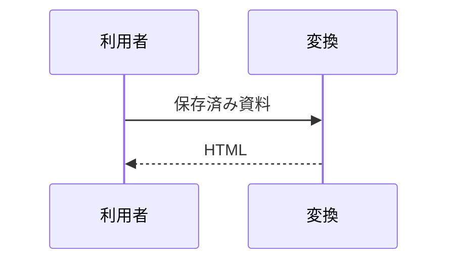
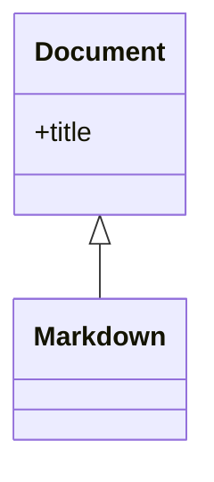
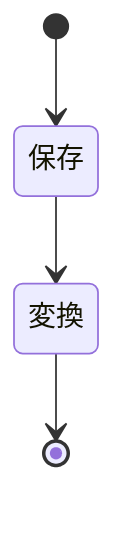
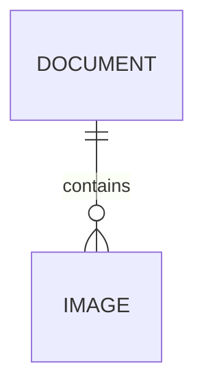
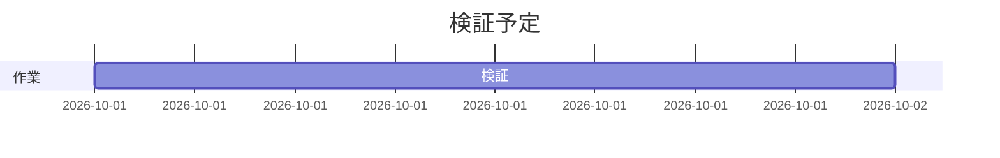
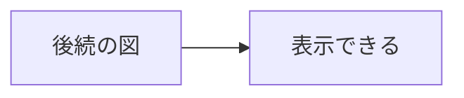

## 日本語の設計メモ

これは架空のサンプルです。**強調**、*斜体*、~~取り消し~~、[Webリンク](https://example.com)、[見出しへ](#日本語の設計メモ)。

### 入力と出力

- 項目
  - 入れ子
- [x] 完了
- [ ] 未完了

1. 保存する
2. 変換する

> 引用文
>
> ```mermaid
> flowchart LR
>   A[日本語の資料] --> B[単一HTML]
> ```

|項目|説明|
|---|---|
|画像||
|参照形式|![画像][picture]|

[picture]: image.svg

PNG:  JPEG:  WebP:  GIF: 

### 入力と出力

同名見出しにも別々のIDが付く。

##### 階層を飛ばした見出し

```javascript
  const greeting = "こんにちは";
console.log(greeting); // コメント

```

```unknown-language
  leading spaces
trailing spaces  

<script>alert('example')</script>
```

数式はテキスト: $a+b$ と $$c=d$$。

```math
x^2 + y^2 = z^2
```

<script>window.unwanted = true;</script>

<div>生HTMLは文字として表示</div>

````markdown
```mermaid
これは説明用コードであり図ではない
```
````

## 代表図











## エラーの後も使える

```mermaid
flowchart LR
  A -->[
```



```text
エラーの後でもコピーできる
```
